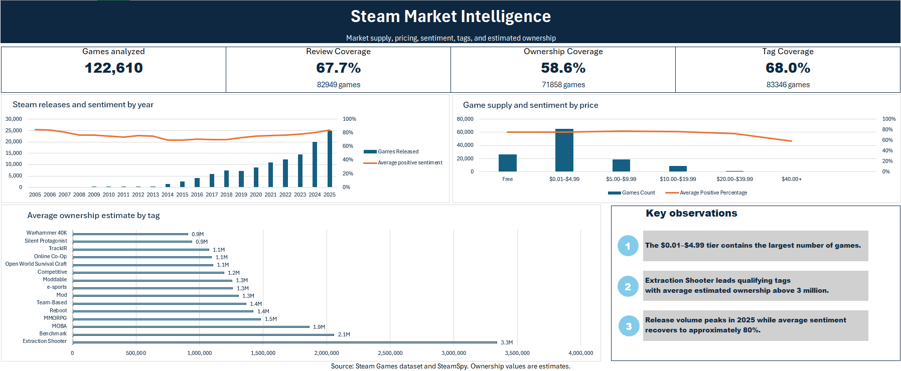

# Steam Market Intelligence

A MySQL and Excel market intelligence project analyzing Steam game supply, pricing, player sentiment, release trends, tags, and estimated ownership.



## Project Overview

This project transforms large raw Steam and SteamSpy datasets into a relational MySQL database and an interactive Excel dashboard.

The goal was to build a repeatable analytics pipeline that could help a producer, product manager, publisher, or market analyst evaluate market supply and game-performance signals across different segments of Steam.

The final dataset contains 122,610 games.

## Analytical Questions

The dashboard focuses on three questions:

1. How do Steam price ranges differ in game supply and review sentiment?
2. Which tags combine meaningful market supply with stronger ownership estimates?
3. How have release volume and player sentiment changed across release years?

A publisher-level reporting view is also included in the SQL layer for future portfolio analysis.

## Dashboard

[Download the Excel dashboard](dashboard/steam_market_intelligence_dashboard.xlsx)

The Excel workbook uses Power Query to connect to the MySQL reporting views and uses PivotTables and PivotCharts for visualization.

### Dashboard coverage

| Metric | Result |
|---|---:|
| Total games | 122,610 |
| Games with reviews | 82,949 |
| Review coverage | 67.7% |
| Games with ownership estimates | 71,858 |
| Ownership coverage | 58.6% |
| Games with tags | 83,346 |
| Tag coverage | 68.0% |
| Distinct tags | 452 |
| Game–tag relationships | 1,180,027 |

## Technology

- MySQL 8.0
- MySQL Workbench
- SQL
- Microsoft Excel
- Power Query
- PivotTables and PivotCharts
- Git and GitHub

## Data Sources

- [Steam Games Reviews 2024 dataset](https://www.kaggle.com/datasets/artermiloff/steam-games-reviews-2024)
- [SteamSpy data snapshot](https://github.com/woctezuma/steamspy-data)

The raw datasets are not included in this repository because of their size. The SQL pipeline expects the source data to be imported into the staging tables before transformation.

## Data Architecture

The database follows a dimensional structure with staging, dimension, bridge, fact, and reporting layers.

### Staging tables

- `stg_games_raw`
- `stg_game_tags`
- `stg_steamspy_raw`
- `stg_game_text_repair`

### Dimension and bridge tables

- `dim_game`
- `dim_tag`
- `bridge_game_tag`

### Fact tables

- `fact_game_snapshot`
- `fact_steamspy_snapshot`
- `fact_reviews_month`

### Reporting views

- `vw_game_kpis`
- `vw_tag_kpis`
- `vw_price_buckets`
- `vw_release_trends`
- `vw_publisher_kpis`
- `vw_dataset_summary`

The MySQL Workbench model is available in [`database-model/steam_market_intelligence.mwb`](database-model/steam_market_intelligence.mwb).

## SQL Execution Order

Run the SQL scripts in this order:

1. `01_create_schema.sql`
2. Import the source files into the staging tables.
3. `02_transform_dim_game.sql`
4. `03_load_tags.sql`
5. `04_load_game_snapshot.sql`
6. `05_create_reporting_views.sql`

The current reporting-view script also loads the cleaned SteamSpy ownership ranges into `fact_steamspy_snapshot`.

## Metric Definitions

### Review coverage

The percentage of games with at least one positive or negative review.

### Average game sentiment

The average of each individual game's positive-review percentage. Each game contributes equally regardless of review volume.

### Review-weighted sentiment

Total positive reviews divided by total reviews. Games with larger review counts contribute more heavily.

### Estimated ownership midpoint

The midpoint between the lower and upper SteamSpy ownership estimates:

`(owners_low + owners_high) / 2`

This value is an analytical proxy. It should not be interpreted as exact ownership, unit sales, or revenue.

### Snapshot dates

The `2026-09-29` game snapshot date represents the technical database load date. The original observation date of the main source dataset is unknown.

The SteamSpy ownership snapshot date is `2025-01-01`, based on the source archive filenames and repository documentation.

## Data Quality and Validation

Validation included:

- Checking primary-key uniqueness
- Checking staged and transformed row counts
- Confirming tag-pair uniqueness
- Checking missing dimension joins
- Checking invalid ownership ranges
- Verifying that reporting joins did not multiply game rows
- Comparing duplicate snapshot batches
- Repairing corrupted UTF-8 text fields
- Excluding unusable SteamSpy playtime fields that contained only zero values

The final tag bridge contains 1,180,027 unique game–tag relationships with no duplicate pairs.

## Limitations

- The main Steam dataset’s original observation date is unknown.
- The game snapshot date is a technical load date, not a confirmed market observation date.
- SteamSpy ownership values are estimated ranges rather than exact sales figures.
- Ownership estimates cover 58.6% of the game dimension.
- Tag data covers 68.0% of games.
- Games can have multiple tags, so tag-level totals represent associations rather than unique games across all tags.
- Multiple publishers stored in one source field remain combined publisher labels.
- SteamSpy playtime fields were excluded because the available values were unusable.
- The current-year release data may represent a partial year.
- The dashboard identifies associations and market patterns, not causal relationships.

## Repository Structure

```text
steam-market-intelligence/
├── dashboard/
│   ├── dashboard_preview.png
│   └── steam_market_intelligence_dashboard.xlsx
├── database-model/
│   └── steam_market_intelligence.mwb
├── sql/
│   ├── 01_create_schema.sql
│   ├── 02_transform_dim_game.sql
│   ├── 03_load_tags.sql
│   ├── 04_load_game_snapshot.sql
│   └── 05_create_reporting_views.sql
├── .gitignore
└── README.md
```

## Author

**Zakhar Sheyko**

Game producer and project manager focused on data-informed production, product strategy, and game publishing.

[Portfolio](https://www.zakharsheyko.com/)
